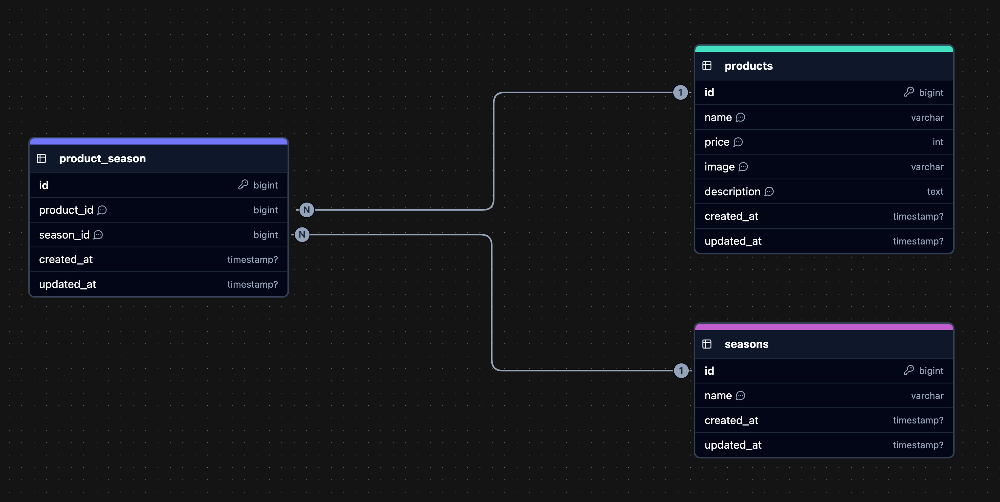

# mogitate

## 環境構築

### Dockerビルド
1. `git clone git@github.com:nihil0000/mogitate-test.git`
2. `docker compose up -d --build`

＊MySQLはOSによって起動しない場合があるため、それぞれのOSに合わせてdocker-compose.ymlファイルを編集してください\
＊開発環境がMacOS (Appleチップ) mysql, phpmyadminにて`platform: linux/amd64`を指定しています

### Laravel開発環境
1. `docker compose exec php bash`
2. `composer install`
3. `cp .env.example .env`を行い、環境変数を変更
    1. `DB_HOST=mysql`, `DB_DATABASE=laravel_db`, `DB_USERNAME=laravel_user`, `DB_PASSWORD=laravel_pass`
4. `php artisan key:generate`
5. `php artisan migrate`
6. `php artisan db:seed`
7. `php artisan storage:link`

## 使用技術
- PHP 7.4.9
- Larabel 8.83.8
- MySQL 8.0.26

## ER図

## URL
- 開発環境
    - http://localhost
- phpMyAdmin
    - http://localhost:8080
